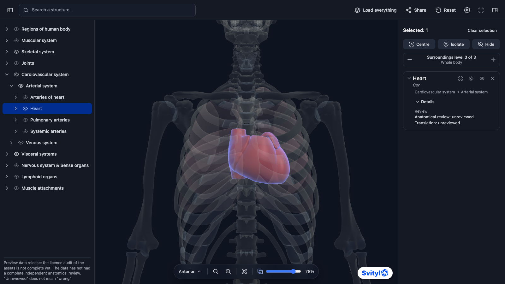

# Svitylo 3D Anatomy Atlas

[](https://github.com/authorOd/3d-anatomy-atlas/actions/workflows/ci.yml)
[](https://www.npmjs.com/package/@authorod/svitylo-3d-anatomy-atlas)
[](https://packagist.org/packages/authorod/svitylo-anatomy-laravel)
[](LICENSE.md)
[](https://svitylo.com/3d-anatomy-atlas)

An independent browser library for an interactive 3D atlas of human anatomy: the `<svitylo-anatomy>`
HTML component, a headless Three.js (WebGL2) core, a versioned package of anatomical data, a demo
page of the full atlas and separate packages for embedding the atlas in notes (Markdown,
Laravel/Livewire). The library itself does not depend on Laravel, accounts, APIs or Svitylo
servers; Svitylo is one of its consumers.

[](https://svitylo.com/3d-anatomy-atlas)

**Demo:** [svitylo.com/3d-anatomy-atlas](https://svitylo.com/3d-anatomy-atlas), the full atlas on
Svitylo.

> **Status: `1.1.0`.** The atlas and the note embeds are implemented and covered by tests. The
> data is on the `preview` channel: the licence audit of the included models is pending, and no
> anatomical review has been done (see [Open items](#open-items)).

## What the atlas does

- Empty start: search, the tree of systems and structures, the "Load everything" button; **no GLB
  requests before the user acts**.
- Selection works the same on the model, in the tree and in search: the structure is added to the
  selection (only its files are loaded); from the tree and search the camera zooms to it at once,
  on the model with a double click; deselecting a structure that was just zoomed to brings the
  camera back. Deselecting (a click, the card's ×, "Clear selection", Escape) never changes the
  scene: it changes only through explicit actions such as the eye, "Hide", "Reset" and "Load
  everything".
- **Surroundings level** of the selection: 0 = only the selection, 1 = the nearest group of every
  selected structure, … the last = the whole body. The stepper shows the level of what is visible; a
  level chosen with − / + decides what is shown around the selection and stays for the next
  selections. The eye in the tree adds other structures, which stay visible at any level.
- **Surroundings transparency**: a slider on the camera bar (0–95%). Above 0 everything that is not
  selected is translucent and the selection stays opaque. A structure selected from the tree or
  search that others cover turns the transparency on (78%).
- "Load everything" with progress, cancelling and a retry of only the failed files; the outer layer
  is the skin.
- Rotate, pan, zoom, standard views; mouse, touch and keyboard. The camera bar at the bottom of the
  scene: the menu of named views, zoom, "Overall view", the "Surroundings transparency" slider.
  "Centre" and "Zoom to" do not put the camera inside other structures.
- A click on a structure adds it to the selection or removes it; a group and its part are never
  selected together. The right column holds the actions on the selection: the common block
  ("Clear selection", "Centre", the "Isolate" and "Hide" toggles, the surroundings level) and a
  compact card for each structure (name, Latin name, the "Zoom to", "Isolate", eye and × icons;
  position in the tree, "Details"). The side columns collapse; the left one can be resized.
- Svitylo design system styles, light and dark themes (`theme`); the scene is always dark.
- Interface and names in English by default; the language control (Ukrainian, English) changes both
  the names and the interface, and the "Show Latin names" toggle shows the Latin name on a second
  line under the name in the current language. Unreviewed Ukrainian names have a dotted underline
  (explained in the legend); when a name is missing, the English one is shown with a language mark.
  Search by names and synonyms in all languages works before any model is loaded; the tree of
  systems starts collapsed.
- Review statuses, sources, licences, gaps, known issues of the data and the corrections made by the atlas in the structure card.
- A manual economy mode (simplified geometry, lower resolution) that does not hide systems.
- "Share": the state in the URL fragment (versioned codec, limits, no silent truncation, JSON export
  for a state too large for a link); "Reset" returns to the state of the link.
- Every link opens in the data the site has now, whatever version made it: structure IDs do not
  change between versions, and the structures the data no longer has are listed.
- Phone: the 3D scene takes ≈86% of the height (only the selection strip is under it); the atlas
  actions are in the header menu; the information about the selection is in a bottom sheet over
  the scene that the user opens; the surroundings level is on the camera bar and the short Svitylo
  logo in the top corner of the scene.
- Accessible UI (WAI-ARIA tree/combobox, keyboard, live announcements), a fallback without WebGL2,
  the visible Svitylo logo with no built-in option to turn it off (CPAL attribution terms apply).
- Lifecycle management: ResizeObserver, pause in the background, render on demand, `dispose()`,
  remounting without piling up contexts and listeners, recovery after a lost WebGL context.

## Quick start

```sh
pnpm add @authorod/svitylo-3d-anatomy-atlas     # the data package is installed automatically
pnpm exec svitylo-anatomy export-assets public/anatomy-data --prune
```

With npm:

```sh
npm install @authorod/svitylo-3d-anatomy-atlas
npx svitylo-anatomy export-assets public/anatomy-data --prune
```

```html
<svitylo-anatomy style="display:block;height:100vh"></svitylo-anatomy>  <!-- lang="uk" for Ukrainian -->
<script type="module">
  import '@authorod/svitylo-3d-anatomy-atlas';
</script>
```

Without `data-url` the component takes the data from `/anatomy-data/<data version>/`, which is
where the export command copies it. Instructions for Vite, other bundlers, CDN, CORS and CSP:
[docs/integration.md](docs/integration.md).

```ts
const atlas = document.querySelector('svitylo-anatomy')!;
atlas.addEventListener('anatomy:ready', async (e) => {
  if (e.detail.kind !== 'ui') return;
  await atlas.showStructure('cardiovascular.heart');
  await atlas.showSurroundings('cardiovascular.heart'); // level 1 around the heart, 78% transparency
});
atlas.addEventListener('anatomy:select', (e) => console.log(e.detail.primary));
```

The full API of the component, the core, the events, the errors and the state format:
[docs/api.md](docs/api.md).

## Embeds in notes

A compact atlas in the text of a note is `<svitylo-anatomy layout="embed">`: until "Show 3D" is
pressed it is only a placeholder that makes no requests; "Open" expands the full atlas (or hands the
view to the site for its own window). The author writes a block

````md
```anatomy
structure: cardiovascular.heart
surroundings: 2
label: Heart
```
````

or pastes a "Share" link on a line of its own. `surroundings: 2` is surroundings level 2 with the
default transparency (78%).

| Package | Purpose |
| --- | --- |
| [`@authorod/svitylo-anatomy-markdown`](packages/markdown/README.md) | markdown-it, rendered HTML in the browser |
| [`authorod/svitylo-anatomy-laravel`](packages/laravel/README.md) | Composer: league/commonmark, Symfony HtmlSanitizer, Blade, Livewire 4 (Laravel 11–13) |

Details: [docs/integration.md](docs/integration.md#11-embeds-in-notes). A demo note: `/notes.html`
in `pnpm demo:dev`.

## Contributing languages

You can propose a language or improve existing translations through a pull request. Partial,
unreviewed drafts are welcome, following the Ukrainian draft format. New language files need
runtime integration before they appear in the atlas. See [CONTRIBUTING.md](CONTRIBUTING.md) for
JSON examples, source/licence requirements, review statuses and the integration checklist.

Bugs, name corrections and device compatibility reports go to
[issues](https://github.com/authorOd/3d-anatomy-atlas/issues/new/choose), each with its own form;
questions and ideas go to [Discussions](https://github.com/authorOd/3d-anatomy-atlas/discussions).
Everyone taking part follows the [Code of Conduct](CODE_OF_CONDUCT.md). Report vulnerabilities
privately, as [SECURITY.md](SECURITY.md) describes.

## Documentation

| Document | Contents |
| --- | --- |
| [docs/integration.md](docs/integration.md) | Installation, data export, Vite, CDN, CORS, CSP, cache, older versions, security |
| [docs/api.md](docs/api.md) | Attributes, methods, events, headless core, state and codec, error codes |
| [docs/data-pipeline.md](docs/data-pipeline.md) | Reproducible pipeline: snapshot, Blender, two qualities, manifest, validation, releases |
| [docs/known-limitations.md](docs/known-limitations.md) | Known limitations |
| [docs/data-roadmap.md](docs/data-roadmap.md) | What the data does not include yet; planned geometry fixes |
| [packages/data/README.md](packages/data/README.md) | Data package, versions, licences, coverage |
| [Coverage report](packages/data/releases/1.1.0/reports/COVERAGE.md) | Systems, gaps, names, review statuses |
| [CHANGELOG.md](CHANGELOG.md) | History of changes |

## Repository layout

```
packages/atlas   @authorod/svitylo-3d-anatomy-atlas — schemas (Zod), core (Three.js), UI (Lit), CLI
packages/data    @authorod/svitylo-3d-anatomy-data — data releases, register of sources and licences
packages/tools   data pipeline (Blender + glTF Transform + meshoptimizer), validation, fixtures
packages/markdown  @authorod/svitylo-anatomy-markdown — the ```anatomy block, markdown-it, HTML/DOM
packages/laravel   authorod/svitylo-anatomy-laravel (Composer) — CommonMark, sanitizer, Blade, Livewire
apps/demo        demo of the full atlas and a note with embeds (notes.html)
test/unit        Vitest: state, migrations, visibility, aliases, search, manifest, resources, pipeline, blocks
e2e              Playwright: empty start, an organ, surroundings, the whole body, errors, links,
                 keyboard, mobile, no WebGL2, CSP, embeds, note
e2e-laravel      Playwright: Livewire 4 on a Testbench test application (workbench)
```

Module boundaries are checked automatically (`pnpm check:boundaries`): the core does not depend on
Lit or the UI, the schemas depend only on Zod, the build imports only Three.js, Lit and Zod, and
there are no requests to third-party hosts and no telemetry; the library has no Laravel/Livewire
code (the Livewire JS bridge is in the Composer package), and the integration packages import only
their own dependencies.

## Development

Requires Node.js ≥ 22.12 and pnpm 10.

```sh
pnpm install
pnpm demo:dev            # demo at http://localhost:5173 (the data is exported to apps/demo/public)
pnpm test                # Vitest
pnpm test:e2e            # Playwright (Chromium, SwiftShader software rendering)
pnpm typecheck
pnpm build               # library: dist/*.js + types
pnpm check:boundaries
pnpm data:validate       # technical validation of the data releases
pnpm check:clean-install # packages → clean Vite project → data export → atlas in the browser (needs the npm registry)
pnpm release:check       # publication check: licences, versions, changelogs, data validation

# Composer package (PHP 8.2+, Composer)
composer install -d packages/laravel
pnpm test:laravel        # PHPUnit + Testbench
pnpm test:laravel:e2e    # Playwright: Livewire 4 on the workbench application
```

The demo with small synthetic data (no GLB of the real model): `http://localhost:5173/?data=fixture`.

GitHub Actions runs the checks on every push and pull request to `main`: the typecheck, the unit
tests, the build, `check:boundaries`, `data:validate` and `release:check` on Node 22 and 24, the
end-to-end tests in Chromium and PHPUnit on PHP 8.2 and 8.4. The Livewire end-to-end tests and the clean-install check run weekly and on demand.

Rebuilding the data from the pinned Z-Anatomy snapshot is described in
[docs/data-pipeline.md](docs/data-pipeline.md) (`pnpm data:source`, `pnpm data:export`,
`pnpm data:build`).

Releases: the npm packages are packed from the release tag (`pnpm pack`) and published with
`npm publish --access public`, the data package first (the library pins its version exactly). The
Composer package is published to Packagist from
[authorOd/svitylo-anatomy-laravel](https://github.com/authorOd/svitylo-anatomy-laravel), a copy of
`packages/laravel` tagged with the same version.

## Open items

These items cannot be replaced by assumptions; `pnpm release:check` reports the ones that have a
machine-readable sign (the audit and channel of the data).

1. **Model audit.** All included Z-Anatomy assets have the audit status `pending`, so the data is on
   the `preview` channel and the atlas shows a notice about it. Assets with NC or unclear rights are
   excluded and marked as gaps (cerebral cortex, white matter); the kidneys and the inner ear come
   from other open models (Human Reference Atlas, OpenEar; CC BY 4.0), also pending audit.
   After an approved audit: a data build with the `release` channel.
2. **Anatomical review.** The data is marked as unreviewed. The Ukrainian names are drafts (most of
   them machine-assisted, prepared by an AI language model) and are shown with a dotted underline
   until an expert reviews them in `sources/reviews.json`.
3. **Logo.** The logo and its short version, the mark (both vectorised from the supplied PNGs), and
   the address https://svitylo.com are built in; when official SVGs are available, replace
   `packages/atlas/assets/svitylo-logo.svg` and `svitylo-mark.svg` and the paths in
   `ui/branding.ts`.

Measurements on physical devices and performance budgets are still to be done. There is no
CKEditor 5 plugin in these packages: Svitylo builds its CKEditor integration itself.

## Licence

Code: [CPAL-1.0](LICENSE.md), with Svitylo attribution specified in Exhibit B. Independent code
in a Larger Work may remain proprietary; the covered code's source obligations still apply.
See [docs/licensing.md](docs/licensing.md) for headless, CLI and network considerations.
Data retains the per-asset licences in [packages/data/LICENSES.md](packages/data/LICENSES.md).
The educational atlas is not intended for diagnosis or treatment.
